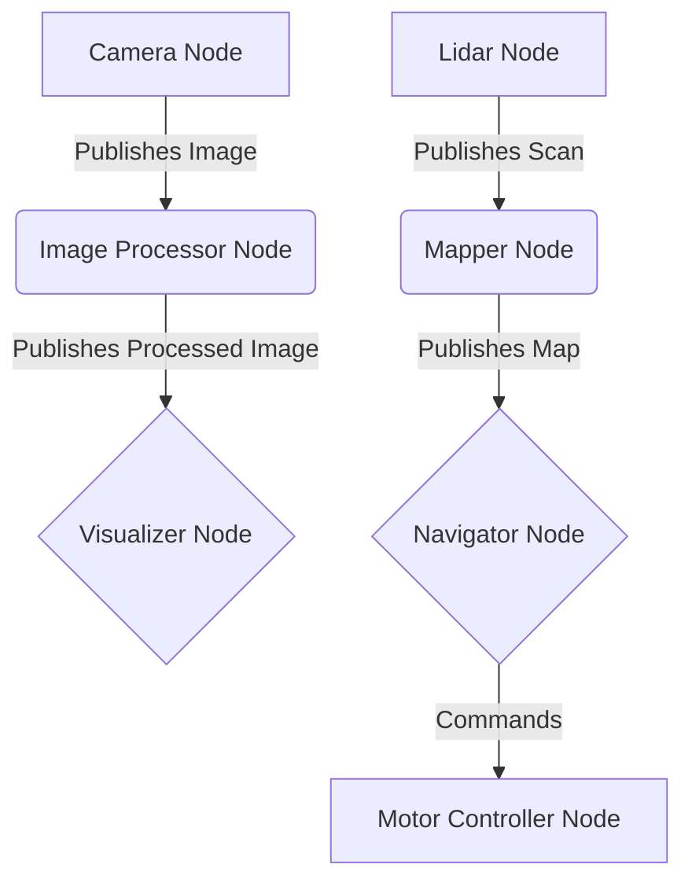

Welcome to Module 1: The Robotic Nervous System (ROS 2). In this chapter, we will introduce the core concepts of ROS 2, the leading open-source middleware for robotics development.

## What is ROS 2?

ROS 2 (Robot Operating System 2) is a flexible framework for writing robot software. It's a collection of tools, libraries, and conventions that aim to simplify the task of creating complex and robust robot behavior across a wide variety of robotic platforms.

Unlike its predecessor, ROS 1, ROS 2 was redesigned with a focus on real-time control, multi-robot systems, and embedded platforms, making it highly suitable for applications in Physical AI and humanoid robotics.

### Key Features of ROS 2:

*   **Distributed Architecture**: Enables components to run on different machines or processes.
*   **Quality of Service (QoS)**: Provides configurable reliability, durability, and latency settings for communication.
*   **Security**: Supports authentication and encryption for secure robot operations.
*   **Real-time Capabilities**: Improved performance for time-critical applications.

## The ROS 2 Graph

At the heart of ROS 2 is the concept of a "ROS Graph"—a network of interconnected processes (nodes) that communicate with each other. This graph allows for modular and distributed development, where each component can be developed and tested independently.

Here's a basic representation of a ROS 2 graph:

In the following chapters, we will delve deeper into each of these concepts, starting with Nodes, Topics, and Services.
